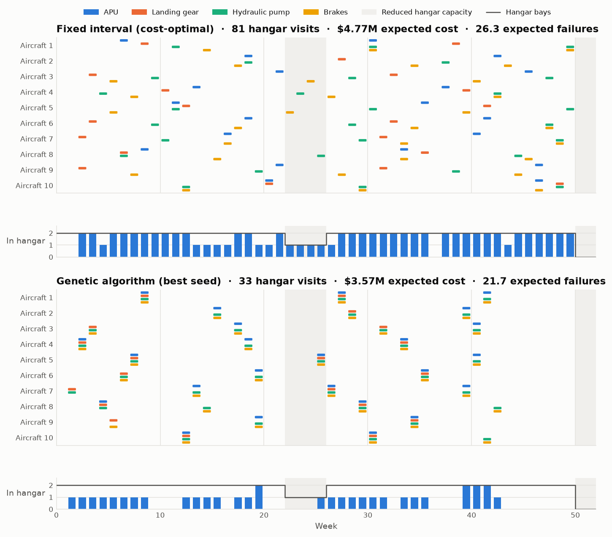
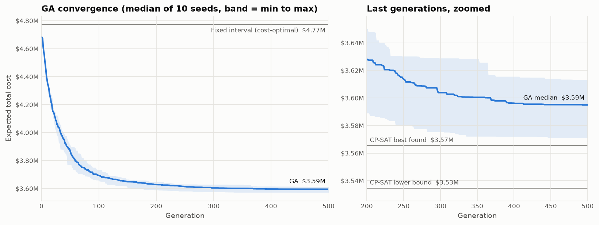
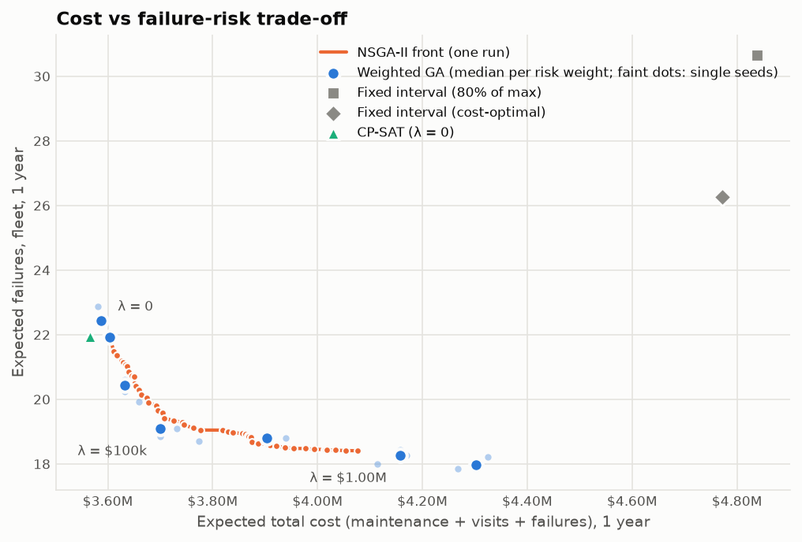
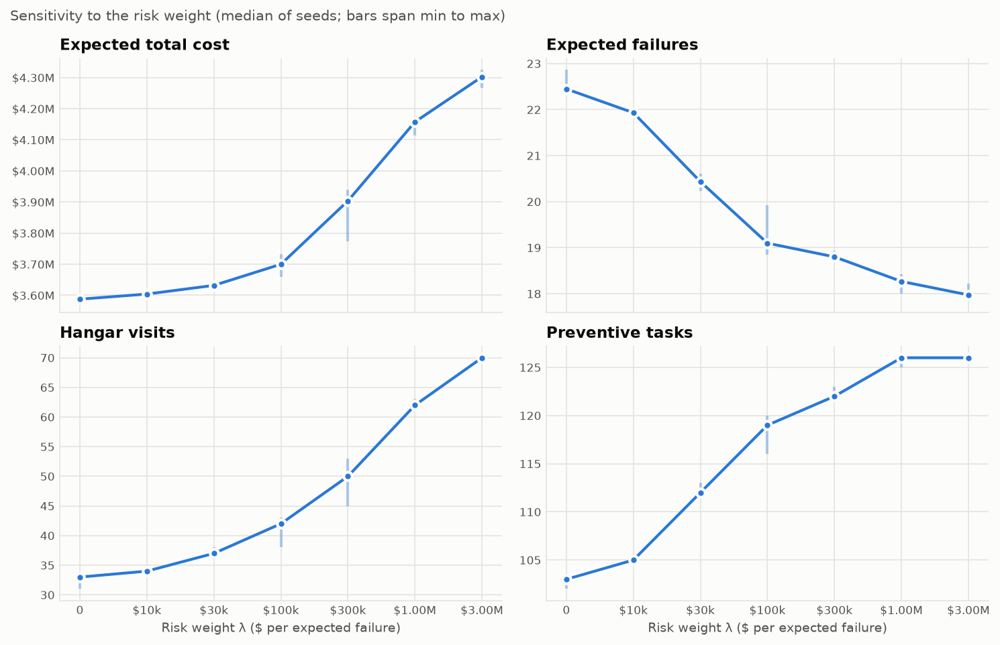
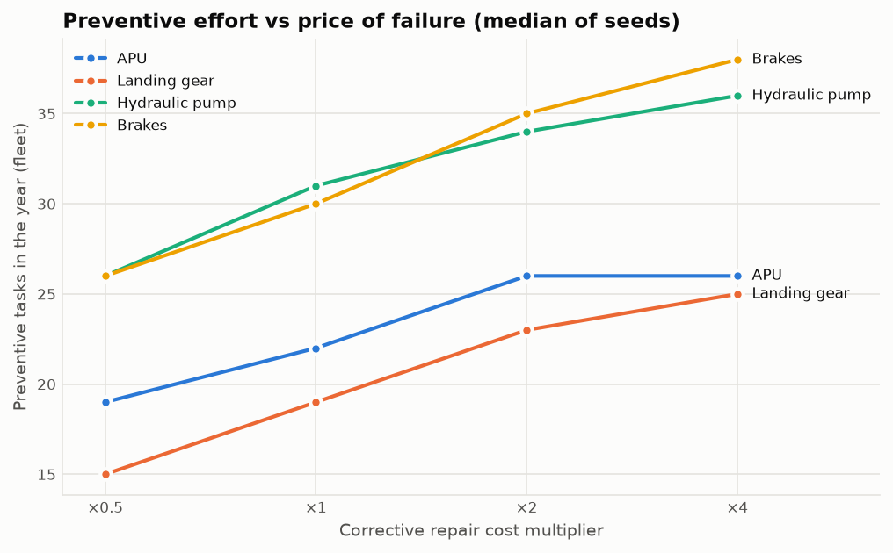

# Preventive Maintenance Optimization with Genetic Algorithms

[](https://github.com/GMCavalheri/Preventive-Maintenance-Optimization-with-Genetic-Algorithms/actions/workflows/tests.yml)

Scheduling a year of preventive maintenance for a 10-aircraft fleet (40 components) with a genetic
algorithm, under hangar, labour and spare-part limits. The GA is benchmarked against fixed-interval
rules and an exact CP-SAT model, and a multi-objective variant (NSGA-II) maps the cost-vs-risk trade-off.



## Headline results

Main instance, seed 0: 10 aircraft × 4 component types × 52 weeks. All numbers are expected
values under the Weibull failure model. The GA figures are the median of 10 seeds.

| Schedule | Expected cost | vs fixed interval | Expected failures | Hangar visits | Aircraft downtime (weeks) |
|---|---:|---:|---:|---:|---:|
| Fixed interval, 80% of max | $4.84M | +1.4% | 30.6 | 68 | 93.5 |
| Fixed interval, cost-optimal per type | $4.77M | — | 26.3 | 81 | 99.9 |
| **Genetic algorithm** | **$3.59M** | **−24.7%** | **22.4** | **33** | **49.2** |
| CP-SAT, 5 min, 10 threads (lower bound $3.53M) | $3.57M | −25.3% | 21.9 | 32 | 48.2 |

* **The GA cuts expected cost by about a quarter** compared with the textbook cost-optimal interval
  for each component type. Most of the saving comes from consolidation: each aircraft's components
  share hangar visits (33 visits instead of 81), which also halves aircraft downtime. Expected
  failures fall at the same time.
* **It is close to optimal.** On five small instances that CP-SAT solves to proven optimality, the
  GA's median gap is 0.00% (worst 0.99%). On the main instance, the median GA run is 1.7% above
  CP-SAT's proven lower bound, and the best of 10 seeds is 1.0% above it.
* **The fixed-interval rules are 21–44% above optimal** on the small instances (median about 40%).
  They are optimal for one component on its own, but ignore that visits can be shared.

## The problem

Each component wears out following a Weibull hazard (shape β > 1). A preventive task renews the
component. A failure in between is repaired minimally, and costs the repair plus the aircraft's
downtime. The plan chooses the weeks in which each component is serviced, and must respect:

* minimum and maximum intervals between tasks per component type (no component ends the year overdue);
* **hangar bays** per week, reduced in peak season (weeks 22–25) and over the holidays (weeks 50–51);
* **labour hours** per week;
* **spare parts**: cumulative use can never exceed stock plus quarterly deliveries.

Each hangar visit grounds the aircraft for a week ($20k), and that cost is shared by every
component serviced during the visit. This is what couples the 40 components and makes the problem
combinatorial. The full model, with notation and all constraints, is in
[docs/formulation.md](docs/formulation.md).

## Methods

| Method | Code | Idea |
|---|---|---|
| Fixed-interval baselines | [`baseline.py`](src/pmo/baseline.py) | Maintain every *I* weeks. *I* is either the closed-form cost-optimal interval or 80% of the max interval. Tasks are staggered around capacity. |
| Genetic algorithm (DEAP) | [`ga.py`](src/pmo/ga.py), [`decoder.py`](src/pmo/decoder.py), [`local_search.py`](src/pmo/local_search.py) | The genotype holds the desired weeks of each component's tasks (their number is evolved too). A greedy decoder repairs every genotype into an interval-feasible, capacity-aware schedule and writes it back (Lamarckian). Crossover swaps component or aircraft blocks. Mutations include shift, add, remove, align, move or merge a whole hangar visit, and a **best-response** move that re-plans one component optimally given the others. |
| Exact model (OR-Tools CP-SAT) | [`exact.py`](src/pmo/exact.py) | Each component's plan is a path in a time-indexed DAG. The expected failures of a segment depend only on its two endpoints, so the objective is exactly linear, with no piecewise approximation. |
| NSGA-II (DEAP) | [`nsga2.py`](src/pmo/nsga2.py) | The same encoding and operators, on the two objectives (expected cost, expected failures). An archive keeps every feasible non-dominated schedule. |
| Shared evaluator | [`evaluate.py`](src/pmo/evaluate.py) | Every method's output is re-scored here, so all comparisons are like for like. |

Two operators made the GA competitive. Both were measured on the main instance against the
CP-SAT lower bound, at 300 generations:
* **Best-response mutation**, a small memetic step: a shortest path over one component's interval
  DAG, the same structure as the exact model. It cut the gap from 7.4% to about 4.6%.
* **Visit-level moves**: shift or merge every task of one hangar visit together. They cut it again, to 2.4%.

## Results in detail

### Convergence



A 500-generation run takes about 30 s on one core. Most of the gain comes in the first 150 generations.

### Cost vs failure risk

The weighted GA minimises *expected cost + λ × expected failures*, where λ is a risk-aversion price
per failure on top of its expected cost. Sweeping λ, 3 seeds per value:

| λ ($ per failure) | Expected cost | Expected failures | Hangar visits | Preventive tasks |
|---:|---:|---:|---:|---:|
| 0 | $3.59M | 22.4 | 33 | 103 |
| 10k | $3.60M | 21.9 | 34 | 105 |
| 30k | $3.63M | 20.4 | 37 | 112 |
| 100k | $3.70M | 19.1 | 42 | 119 |
| 300k | $3.90M | 18.8 | 50 | 122 |
| 1M | $4.16M | 18.3 | 62 | 126 |
| 3M | $4.30M | 18.0 | 70 | 126 |



* **Reliability is cheap at first, then expensive.** Going from 22.4 to 19.1 expected failures costs
  3%. Removing the next 1.1 failures costs another 16%.
* **Spare parts cap preventive effort.** Past λ ≈ 1M the fleet is at the parts limit (126 tasks).
  Extra risk aversion can then only buy more hangar visits, spreading the same tasks thinner, with
  little effect on failures.
* **Many different schedules are near-optimal.** Two GA seeds at the same λ = 0 differ in about
  150–180 tasks, counted as tasks removed plus tasks added (each schedule has about 103), yet the
  costs of all 10 seeds fall within 1.2% of each other. The exact week of any single task is a weak signal. What is stable, and what
  a planner should act on, is the policy: how often each type is serviced and how tasks are grouped
  into visits.
* **NSGA-II** finds 53 non-dominated schedules in a single 40 s run. At four of the five risk levels
  where the two approaches overlap, it matches or beats the weighted-sum GA within 1%. At
  λ = 100k it is 2.1% more expensive. It also does not reach the lowest-failure end (it stops at
  18.4 failures; weighted runs reach 18.0). A sweep of weighted runs is still the more precise tool
  when a specific λ is known.



### Price of failure

Scaling the corrective repair cost from ×0.5 to ×4 raises preventive effort for every component
type. Landing gear responds most in relative terms (15 → 25 tasks in the year), brakes most in
absolute terms (26 → 38). The APU flattens out above ×2 at 26 tasks, which is exactly its
spare-part supply for the year:



### When to use which method

On this problem, a well-formulated exact model is the strongest single method. CP-SAT reaches
0.9% of proven optimality in 5 minutes. The GA gets within about 2% in 30 s, on one core, with no
solver. The GA is the better fit when the model stops being linear or convex in the arc variables.
Examples are imperfect repair, condition-based risk curves from a RUL model, stochastic
lead times, or simulation-based evaluation. There, `evaluate.py` can change freely while the exact
model would need reformulating. NSGA-II adds a whole trade-off curve per run instead of one point per λ.

## Reproduce

```bash
uv venv .venv && uv pip install --python .venv/bin/python -e ".[dev]"
```

```bash
.venv/bin/python -m pytest
```

```bash
.venv/bin/python scripts/run_all.py --seed 0
```

`run_all.py` takes about 12 minutes on 10 workers. It regenerates `results/` (CSV, JSON and
`summary.md` with acceptance checks) and every figure in `figures/`, including an interactive Gantt
chart (`figures/schedule.html`) that compares the fixed-interval, GA and CP-SAT schedules. Use
`--quick` for a one-minute smoke test. To run a single method:

```bash
.venv/bin/python scripts/run_ga.py --risk-weight 1e5
```

```bash
.venv/bin/python scripts/run_exact.py --small
```

The tests include CP-SAT agreeing with brute-force enumeration of every schedule on a tiny
instance, the evaluator matching hand-computed values, and the decoder always satisfying the interval
constraints.

## Repository layout

```
docs/formulation.md      mathematical model
docs/04-...-en.md        original project spec
src/pmo/instance.py      data model and seeded scenario generator
src/pmo/risk.py          Weibull / minimal-repair failure model
src/pmo/evaluate.py      costs, risk, downtime and constraint violations (single source of truth)
src/pmo/decoder.py       desired weeks -> feasible schedule
src/pmo/baseline.py      fixed-interval policies
src/pmo/local_search.py  best-response re-planning of one component
src/pmo/ga.py            weighted GA (DEAP)
src/pmo/nsga2.py         NSGA-II (DEAP)
src/pmo/exact.py         CP-SAT model
src/pmo/sensitivity.py   risk-weight and failure-cost sweeps
src/pmo/experiments.py   pipeline behind run_all.py
src/pmo/viz.py           figures
scripts/                 command-line entry points
tests/                   pytest suite
```

## Limitations and next steps

* The data is synthetic and illustrative, not OEM reliability data.
* A hangar visit always costs one week, however many tasks it holds. There is no terminal value for
  the age at which components end the year.
* **RUL integration.** A predictive model could replace the Weibull hazard of each component with its
  own risk curve. Only `Instance.hazard_tables` and `priority_order` need per-component values.
  The GA and evaluator work unchanged. The exact model stays linear as long as segment risk depends
  only on its endpoints.
* Rolling-horizon re-planning (re-optimise each month as failures and deliveries happen) would
  turn this into an operational tool.

## License

[MIT](LICENSE) © 2026 Gabriel Milanez Cavalheri
